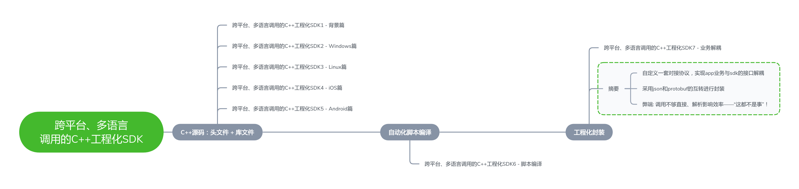
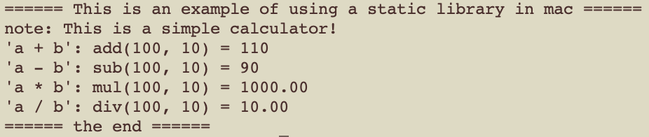

[TOC]

# 跨平台、多语言调用的C++工程化SDK1 - 背景篇

## 1.背景

​      常言道：“千年的语言万年的c”。虽然近些年各类计算机语言层出不穷，但c语言作为最接近底层硬件的计算机高级语言，到目前为止，从未跌出过排行榜前十。同样作为超类的c++语言，虽然因为其自身的特性带来诸多争议，但它的火热几十年来也从未曾退过，况且c++新标准的出炉，更是为它带来无限的活力。不可置否，在音视频开发、游戏引擎等追求高性能的领域，往往就采用c或c++作为sdk，来支撑上层以java、c#等语言开发的应用程序。
    本系列文章及工程范例，就以一个支持“四则运算”的计算器作为c++ sdk实现的简单功能，讲述如何在linux、windows、mac、android、iOS等不同的主流操作系统平台下，且使用c++、java、objective-c等各种不同的上层语言来对c++ sdk进行调用。简单来说，就是演示如何实现一个支持跨平台、多语言调用的c++ sdk。[下载源码示例](sss) 
    我们将分7篇文章，逐一深入讲解一个完整的、专业的、可用于实际项目工程中的sdk，如下图：

    先来看看利用c++实现一个“四则运算”的计算器代码，功能相当简单：  

```c++
#include <stdio.h>
#include <stdlib.h>
#include <Windows.h>

/*计算器：实现加、减、乘、除的运算*/
class Calc
{
public:
    Calc() {}
    ~Calc() {}

public:
    int add(int a, int b) { return a + b; }
    int sub(int a, int b) { return a - b; }
    double mul(double a, double b) { return a * b; }
    double div(double a, double b) { return IS_DOUBLE_ZERO(b) ? 0 : (a / b); }
};

/*demo: 演示加、减、乘、除的用法*/
int main(int argc, char* argv[])
{
	Calc *calc = new Calc();
	if (calc)
  {
		printf("note: This is a simple calculator!\n");
			
    int a = 100;
    int b = 10;
		printf("'a + b': add(%d, %d) = %d\n", a, b, calc->add(a, b));
		printf("'a - b': sub(%d, %d) = %d\n", a, b, calc->sub(a, b));
		printf("'a * b': mul(%d, %d) = %.2f\n", a, b, calc->mul((double)a, (double)b));
		printf("'a / b': div(%d, %d) = %.2f\n", a, b, calc->div((double)a, (double)b));

		delete calc;
	}
	else
	{
		printf("error: failed to create calc!\n");
	}

	system("Pause");
	return 0;
}
```

  Calc类实现了加减乘除，windows上演示效果如下：


## 2.SDK

  在软件工程化管理过程中，经常会将程序进行模块化分层，于是很自然地将上述代码分为两层：main函数实现的功能为上层，即UI层，显然UI层根据实际情况可选择用java、objective-c、c++等不同的语言实现，运行在android、windows、iOS等各种操作系统中；底层calc专门实现特定的核心功能，如本项目中的计算器功能。

### 2.1.库文件

​	假设这个计算器的核心功能就用一份c++代码实现，需提供给各种不同的UI进行调用，我们一般不会将源码直接给到第三方使用，而是提供一个库(library)文件。所谓的“库文件”，说白了就是一段编译好的二进制代码（相当于一个黑盒子），加上头文件（暴露出操作黑盒子的输入输出方法）就可以供别人使用。库的好处还可以减少编译的时间，我们将相对稳定的代码打包成了库，而库已经是编译好了的二进制文件，所以编译时只需要链接（link）一下即可，不再浪费编译的时间。
  说到链接（Link），则有两种方式：静态链接和动态链接。当然，静态链接和静态库（或静态链接库）是有区别的，我们先来看看静态库和动态库。

#### 2.1.1. 静态库 

​	静态库即静态链接库。 静态库在编译的时候会被直接拷贝一份，复制到目标程序里，这段代码在目标程序里就不会再改变了。 

* 优点:  编译完成之后，库文件对上层就完全透明了。目标程序没有外部依赖，直接就可以运行。

* 缺点：会使目标程序的体积增大。  

静态库文件在不同操作系统平台下的表现形式如下：  

```shell
Windows：.lib  
linux/mac/android/ios: .a  
```

#### 2.1.2. 动态库  

​	动态库即动态链接库。与静态库相反，动态库在编译时并不会被拷贝到目标程序中，目标程序中只会存储指向动态库的引用。等到程序运行时，动态库才会被真正加载进来。  

* 优点:  不需要拷贝到目标程序中，不会影响目标程序的体积，而且同一份库可以被多个程序使用（因为这个原因，动态库也被称作共享库）。同时，编译时才载入的特性，也可以让我们随时对库进行替换，而不需要重新编译代码。

* 缺点:  动态载入会带来一部分性能损失，使用动态库也会使得程序依赖于外部环境。如果环境缺少动态库或者库的版本不正确，就会导致程序无法运行（Linux下喜闻乐见的 lib not found 错误）。  

  动态库文件在不同操作系统平台下的表现形式如下：  

```
Windows：.dll  
linux/android: .so  
mac: .so, .dylib  
ios: .dylib  
```

#### 2.1.3. framework

​	除了上面提到的.a 和.dylib 之外，Mac OS/iOS 平台还可以使用Framework。Framework实际上是一种打包方式，将库的二进制文件，头文件和有关的资源文件打包到一起，方便管理和分发。具体在iOS章节会详细讲述。  

### 2.2.头文件

 不管静态库还是动态库文件，对上层调用程序来说都是完全透明的“黑盒子”，即上层程序对库文件的具体实现一无所知，只能通过它暴露出来的几个接口，来使用操作它。
 所以，我们将Calc类编译成库，并将实现加、减、乘、除的方法暴露给上层程序调用。于是我们对背景代码进行改造，头文件sdk.h提供给上层调用，sdk.cpp编译成库文件。如下：

* 头文件：include/sdk.h


```C++
// sdk.h
#ifndef _JVT_SDK_H_
#define _JVT_SDK_H_

#if defined(__cplusplus)
#	define EXT_C extern "C"
#else
#	define EXT_C
#endif

#ifdef WIN32
#	ifdef CALC_SDK_DLL_EXPORTS
#		define SDK_API EXT_C __declspec(dllexport)
#	else
#		define SDK_API EXT_C __declspec(dllimport)
#	endif//CALC_SDK_DLL_EXPORTS
#	define CALLCON /*__stdcall*/
#else
#	define SDK_API extern
#	define CALLCON
#endif//WIN32

/*回调：返回结果，一般用在异步调用的返回*/
class ICalcCbk
{
public:
    virtual ~ICalcCbk(){}
    virtual int on_result(const char *result) = 0;
};

/*计算器接口：加、减、乘、除*/
class ICalc
{
public:
    virtual ~ICalc(){}
    virtual void release() = 0;
    virtual const char* note() = 0;
	
    virtual int add(int a, int b) = 0;         
    virtual int sub(int a, int b) = 0;         
    virtual double mul(double a, double b) = 0;
    virtual double div(double a, double b) = 0;
};

/*导出函数：创建或销毁计算器对象*/
SDK_API ICalc* CALLCON create_calc(ICalcCbk* cbk);
SDK_API	void CALLCON destroy_calc(ICalc* calc);//该接口可以去掉，用ICalc::release()代替

#endif//_JVT_SDK_H_
```
​	该头文件为windows、linux、mac通用，保证一份代码即可。

* 实现文件：src/sdk.cpp, src/calc.cpp   —> 将编译成库文件  

```c++
/*计算器功能的具体实现*/
class Calc : public ICalc
{
    Calc(): cbk_(NULL) {}
public:
    Calc(ICalcCbk cbk): cbk_(cbk) {}
    virtual ~Calc() {}
  	virtual void release() { delete this; }

public:
    virtual int add(int a, int b) {
        if (cbk_) cbk_->on_result("a + b");
        return a + b;
    }
    virtual int sub(int a, int b) {
        if (cbk_) cbk_->on_result("a - b");
        return a - b;
    }
    virtual double mul(double a, double b) {
        if (cbk_) cbk_->on_result("a * b");
        return a * b;
    }
    virtual double div(double a, double b) {
        if (cbk_) cbk_->on_result("a / b");
        return IS_DOUBLE_ZERO(b) ? 0 : (a / b);
    }
	
private:
    ICalcCbk* cbk_;
};

/*导出函数的具体实现*/
SDK_API ICalc* CALLCON create_calc(ICalcCbk* cbk)
{
	return new Calc(cbk);
}

SDK_API	void CALLCON destroy_calc(ICalc* calc)
{
	if (calc)
		delete calc;
}
```

​	将sdk.cpp编译成库文件(如: 静态库calc_sdk.a或动态库calc_sdk.so)，加上头文件sdk.h，即可被其它应用程序所集成了。

### 2.3.调用SDK

​	同样，对main函数进行改造，模拟应用程序加载库文件sdk.a，通过sdk.h操作计算器, linux下c++的简单代码实现如下：

```c++
#include <stdio.h>
#include <stdlib.h>
#include "sdk.h"

class CalcCbk: public ICalcCbk
{
public:
	CalcCbk() {}
	~CalcCbk() {}
public:
	virtual int on_result(const char *result) { printf("'%s': ", result); return 0; }
};

int main(int argc, char* argv[])
{
	printf("====== This is an example of using a static library in mac ======\n");

	CalcCbk *cbk = new CalcCbk();
	ICalc *calc = create_calc(cbk);
	if (calc)
	{
		printf("note: %s\n", calc->note());	

		int a = 100;
		int b = 10;
		printf("add(%d, %d) = %d\n", a, b, calc->add(a, b));
		printf("sub(%d, %d) = %d\n", a, b, calc->sub(a, b));
		printf("mul(%d, %d) = %.2f\n", a, b, calc->mul((double)a, (double)b));
		printf("div(%d, %d) = %.2f\n", a, b, calc->div((double)a, (double)b));

		destroy_calc(calc);
	}
	else
	{
		printf("error: failed to create calc!\n");
	}
	if (cbk) delete cbk;

	printf("====== the end ======\n");
	return 0;
}
```

演示结果如下：



## 3.如何工程化、跨平台、且供多言语调用？

​	有了库文件这个“黑盒子”，并且有了头文件这个操作“黑盒子”的系列方法，即是一个完整的sdk，可为上层提供特定的功能。那如何用一份源代码，编译出不同系统平台的sdk，并供不同编程语言的应用程序进行调用呢？接下来几篇文章即将娓娓道来。。。。。。

