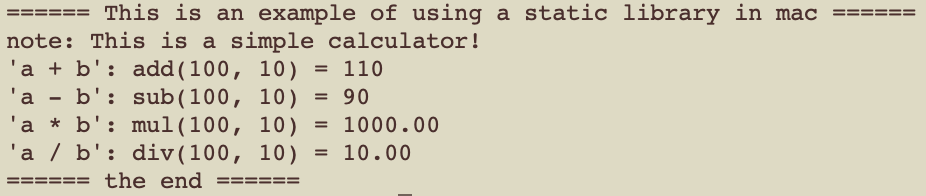

[TOC]

# 跨平台、多语言调用的C++工程化SDK3 - linux篇

## 1.背景

​	

​	首篇: [跨平台、多语言调用的C++工程化SDK1 - 背景篇](file:///1.背景.md)

​	源码: [源码示例](sss)

工程目录结构如下：

```shell
.
├── bin
│   └── linux
│       ├── calc_a_demo
│       └── calc_so_demo
├── build
├── doc
├── include
│   └── sdk.h
├── lib
│   ├── libcalc_sdk.a
│   └── libcalc_sdk.so
├── sample
│   └── linux
│       ├── calc_a_demo
│       │   └── main.cpp
│       └── calc_so_demo
│           └── main.cpp
└── src
    ├── calc.cpp
    ├── calc.h
    ├── sdk.cpp
    └── sdk.h

```

本篇描述将c++代码编译成linux系统下的静态库或共享库，供c++程序调用。

注意：**以下方法同样适用于mac系统！**


## 2.静态库: libcalc_sdk.a

### 2.1.编译

​	切换到src目录下，在命令窗口输入如下：

```shell
$g++ -c *.cpp
$ar -rs ../lib/libcalc_sdk.a *o
```

​	第一行命令表示生成目标文件(.o)，第二行命令表示在lib目录下生成静态库(libcalc_sdk.a)；此外，将src目录下的sdk.h拷贝到include目录下。至此，对外发布include和lib目录，即可让应用程序集成计算器这个c++静态库。

### 2.2.调用

* 首先，看看代码sample/linux/calc_a_demo/main.cpp的实现，如下：

```c++
#include <stdio.h>
#include <stdlib.h>
#include "sdk.h"

class CalcCbk: public ICalcCbk
{
public:
	CalcCbk() {}
	~CalcCbk() {}
public:
	virtual int on_result(const char *result) { printf("'%s': ", result); return 0; }
};

int main(int argc, char* argv[])
{
	printf("====== This is an example of using a static library in mac ======\n");

	ICalc *calc = jvt_create_calc();
	if (calc)
	{
		printf("note: %s\n", calc->note());	
		CalcCbk *cbk = new CalcCbk();  calc->bind(cbk);

		int a = 100;
		int b = 10;
		printf("add(%d, %d) = %d\n", a, b, calc->add(a, b));
		printf("sub(%d, %d) = %d\n", a, b, calc->sub(a, b));
		printf("mul(%d, %d) = %.2f\n", a, b, calc->mul((double)a, (double)b));
		printf("div(%d, %d) = %.2f\n", a, b, calc->div((double)a, (double)b));

		if (cbk) delete cbk;
	  jvt_destroy_calc(calc);
	}
	else
	{
		printf("error: failed to create calc!\n");
	}

	printf("====== the end ======\n");
	return 0;
}
```

* 然后，编译main.cpp，切换到sample/linux/calc_a_demo/目录下，在命令窗口输入：

```shell
$g++ -o ../../../bin/linux/calc_a_demo *.cpp -I../../../include -L../../../lib -lcalc_sdk
```

* 最后，运行calc_a_demo, 切换到bin/linux/，在命令窗口输入：

```shell
$./calc_a_demo
```

演示结果如下：




## 3.共享库: libcalc_sdk.so

### 3.1.编译

​	切换到src目录下，在命令窗口输入如下：

```shell
$g++ -o ../lib/libcalc_sdk.so -shared -fPIC *.cpp
```

​	这里用一行命令，一步到位在lib目录下生成了动态库(libcalc_sdk.so)，当然也可以像静态库一样采用两个命令生成。同理，像静态库一样，对外发布include和lib目录，即可让应用程序集成计算器这个c++动态库。

### 3.2.调用

* 首先，看看代码sample/linux/calc_so_demo/main.cpp的实现，如下：

```c++
#ifdef WIN32
#	define DYNLIB_HANDLE 					HINSTANCE
#	define DYNLIB_LOAD(a) 				LoadLibrary(a)
#	define DYNLIB_GETSYM(a, b) 		GetProcAddress(a, b)
#	define DYNLIB_UNLOAD(a) 			(bool)!FreeLibrary(a)
#else
#	define DYNLIB_HANDLE 					void*
#	define DYNLIB_LOAD(a) 				dlopen(a, RTLD_NOW)
#	define DYNLIB_GETSYM(a, b) 		dlsym(a, b)
#	define DYNLIB_UNLOAD(a) 			dlclose(a)
#endif

class ModuleFactory
{
public:
	ModuleFactory(const char* module_file)
	: handler_(NULL)
	{
		if (module_file != NULL)
			init(module_file);
	}

	~ModuleFactory(void)
	{
		if (handler_ != 0)
			DYNLIB_UNLOAD(handler_);
	}

public:
  template<class T>
  T* create_module(const char* func_name)
  {
      typedef	T* (*PFN)();
      PFN pfn = 0;
      T* func = 0;
      
			pfn = (PFN)load_func(func_name);
      if (pfn)
          func = pfn();

      return func;
  }

	void* load_func(const char* func_name)
	{
		if (handler_ == 0)
		{
			LOG_ERR("failed to load '%s', error code: handler_ is null", func_name);
			return NULL;
		}

		void *pfn = DYNLIB_GETSYM(handler_, func_name);
		if (!pfn)
		{
			LOG_ERR("failed to dlsym '%s'! error code: '%s'", func_name, p_last_error());
			return NULL;
		}

		return pfn;
	}

protected:
	bool init(const char* module_file)
	{
		handler_ = DYNLIB_LOAD(module_file);
		if (handler_ == 0)
		{
			LOG_ERR("failed to dlopen '%s'! error code: '%s'", module_file, p_last_error());
			return false;
		}
		return true;
	}

private:
	DYNLIB_HANDLE handler_;
};
```

​	这里封装了一个工厂类，通过load_func()获得共享库导出的函数，通过create_module()获得共享库创建的操作对象。其实它的内部核心无非是封装了几个系统函数，linux/mac系统函数如：dlopen()，dlsym()，dlclose()。同理，window系统函数如：LoadLibrary(), GetProcAddress()，FreeLibrary()，所以windows下的动态库demo也可以利用类型的方法使用calc_sdk.dll，见[跨平台、多语言调用的C++工程化SDK2 - windows篇](file:///windows.md)，有兴趣的读者可以自行对其改造。

​	使用计算器的功能，动态库和静态库的方法几乎是一样的，如下：

```c++
int main(int argc, char* argv[])
{
	printf("====== This is an example of using a dynamic library in mac ======\n");

	ModuleFactory fac("../../lib/libcalc_sdk.so");

	ICalc *calc = fac.create_module<ICalc>("jvt_create_calc");
	if (calc)
	{
		printf("note: %s\n", calc->note());	
		CalcCbk *cbk = new CalcCbk();  calc->bind(cbk);

		int a = 100;
		int b = 10;
		printf("add(%d, %d) = %d\n", a, b, calc->add(a, b));
		printf("sub(%d, %d) = %d\n", a, b, calc->sub(a, b));
		printf("mul(%d, %d) = %.2f\n", a, b, calc->mul((double)a, (double)b));
		printf("div(%d, %d) = %.2f\n", a, b, calc->div((double)a, (double)b));

		if (cbk) delete cbk;
		calc->release();
	}
	else
	{
		printf("error: failed to create calc!\n");
	}

	printf("====== the end ======\n");
	return 0;
}
```

* 然后，编译main.cpp，切换到sample/linux/calc_so_demo/目录下，在命令窗口输入：

```shell
$g++ -o ../../../bin/linux/calc_so_demo *.cpp -I../../../include -ldl
```

* 最后，运行calc_so_demo, 切换到bin/linux/，在命令窗口输入：

```shell
$./calc_so_demo
```

演示结果如下：


### 3.3.设置动态库加载路径

​	如demo中所示，其中ModuleFactory fac("../../lib/libcalc_sdk.so")，在代码中指定了共享库的相对路径。如果只是ModuleFactory fac("libcalc_sdk.so")，当然是找不到共享库的，除非.so和可执行程序calc_so_demo在同一个目录中。

​	那有没有办法，不需要在代码中指定共享库的路径呢？当然有，且实际项目中经常这么做，还便于集中管理众多不同的共享库，方法如下：

* 1.将.so放到系统目录下，如：

     1) /lib：		可将动态库放入/lib中  

     2) /usr/lib:    可将动态库放入/usr/lib中

* 2.**永久设置（推荐**）：

  ​	1). 编辑配置文件/etc/ld.so.conf，将库文件所在的目录(绝对路径)添加进来。

  或者， 编辑/etc/ld.so.conf.d，添加 *.conf 如（sdk.conf）, 然后：

  ```shell
  $sudo chmod 777 sdk.conf
  $gedit sdk.conf
  在sdk.conf中添加库文件所在的目录(绝对路径)
  ```

  　2). 刷新ldconfig：

   ```shell
   $sudo ldconfig
   ```

  ​	**这步很重要，勿遗漏！**当已添加的目录又增加了新的共享库时，直接操作该命令刷新即可

* 3.临时设置：

  ```shell
  $export LD_LIBRARY_PATH = ../../../lib/
  ```

  系统重启后将失效。

* 4.运行时自动加载动态链接库：

  ```shell
  $g++ -m32 *.cpp -o demo -L../../../lib/ -lcacl_sdk -Wl,--rpath=../../../lib/ 
  ```

  其中,

  “-m32”: 参数是编译32位的可执行文件；

  “-L”: 需要链接的动态链接库的目录路径；

   “-l”: 需要链接的链接库名称（如库文件libname.so,则-l后面的参数是name）;

  "-Wl,--rpath＝"：为运行时链接动态链接库目录的地址; 

  

  同理，运行时自动加载静态链接库： 

  ```shell
  $g++ -m32 *.cpp -o demo -I../../../lib/ lcacl_sdk -Wl,--rpath=../../../lib/
  ```

### 3.4.查看导出函数

```shell
$nm -g libcalc_sdk.so
```

其中，

* -D或-dynamic: 表示显示动态符号（该选项仅对于动态库有意义），得到的结果中以T开头的就是导出函数
* -C: 查看C ++库的符号
* -g / -gC:

除此还有命令：

```shell
$readelf --symbols  *.so.* 
```

```shell
$objdump -T *.so.*
```

