[TOC]

# 跨平台、多语言调用的C++工程化SDK4 - iOS篇

## 1.背景

​	

​	详见首篇: [跨平台、多语言调用的C++工程化SDK1 - 背景篇](file:///1.背景.md)

​	详见源码: [源码示例](sss)

工程目录结构如下：

```c++
.
├── bin
├── build
│   └── project
│       └── ios
│           ├── calc_sdk_a
│           │   ├── calc_sdk.xcodeproj
│           │   └── calc_sdk_a
│           │       ├── calc_sdk_a.h
│           │       └── calc_sdk_a.mm
│           └── calc_sdk_f
│               ├── calc_sdk
│               │   ├── Info.plist
│               │   └── calc_sdk.h
│               └── calc_sdk.xcodeproj
├── doc
├── include
│   └── sdk.h
├── lib
│   └── libcalc_sdk.so
├── sample
│   └── ios
│      ├── calc_a_demo
│      │   ├── calc_a_demo
│      │   └── calc_a_demo.xcodeproj
│      └── calc_f_demo
│          ├── calc_f_demo
│          ├── calc_f_demo.xcodeproj
│          └── calc_sdk.framework
└── src
    ├── calc.cpp
    ├── calc.h
    ├── sdk.cpp
    └── sdk.h

```

本篇描述将c++代码编译成iOS系统下的静态库、共享库或framework，供objective-c程序调用。

  为提供给iOS调用，通常会将c++编译成以下几种方式:  

* 静态库: .a
* 动态库: .dylib
* 打包方式: .framework  

  .a与其他系统提到的静态库原理相同，不再赘述。值得注意的是，只有由iOS系统自身提供的动态库.dylib方可自由使用。众所周知，iOS处于安全考虑，将APP应用程序运行在沙盒中，不同的程序之间不能共享代码。在iOS开发过程中，你可以自己编译成.dylib，且能被iOS的APP应用程序调用成功，但是自己生成的.dylib的APP应用程序不能上架App Store。况且动态下载代码也被苹果明令禁止，因此，实际上动态库.dylib在iOS应用开发中是没有必要存在的。
  然而，.framework有所不同，它实际上是一种打包方式，将库的二进制文件，头文件和有关的资源文件打包到一起，方便管理和分发。在 iOS 8 之前，iOS 平台不支持使用动态 .framework，开发者可以使用的.framework 只有苹果自家的 UIKit.framework，Foundation.framework 等。此时，开发者想要在 iOS 平台共享代码，唯一的选择就是打包成静态库 .a 文件，同时附上头文件（例如微信的SDK）。但是这样的打包方式不够方便，使用时也比较麻烦，大家还是希望共享代码都能像 Framework 一样，直接扔到工程里就可以用。于是人们想出了各种奇技淫巧去让 Xcode Build 出 iOS 可以使用的 Framework，但这种方法产生的 Framework 还有 “伪”(Fake) Framework 和 “真“(Real) Framework 的区别。
  当iOS 8/Xcode 6 推出之后，iOS 平台添加了动态库的支持，同时 Xcode 6 也原生自带了 Framework 支持（动态和静态都可以），上面提到的的奇技淫巧也就没有必要了。为什么 iOS 8 要添加动态库的支持？唯一的理由大概就是 Extension 的出现。Extension 和 App 是两个分开的可执行文件，同时需要共享代码，这种情况下动态库的支持就是必不可少的了。但是这种动态 Framework 和系统的 UIKit.Framework 还是有很大区别。系统的 Framework 不需要拷贝到目标程序中，我们自己做出来的 Framework 哪怕是动态的，最后也还是要拷贝到 App 中（App 和 Extension 的 Bundle 是共享的），因此苹果又把这种 Framework 称为 Embedded Framework。

## 2.静态库: libcalc_sdk.a

### 2.1.通过Xcode生成c++静态库的方法步骤

* step1:  
运行Xcode，选择“Create a new Xcode project", 依次选择“iOS”->“Framework & Library”->“Cocoa Touch Static Library”。如图: 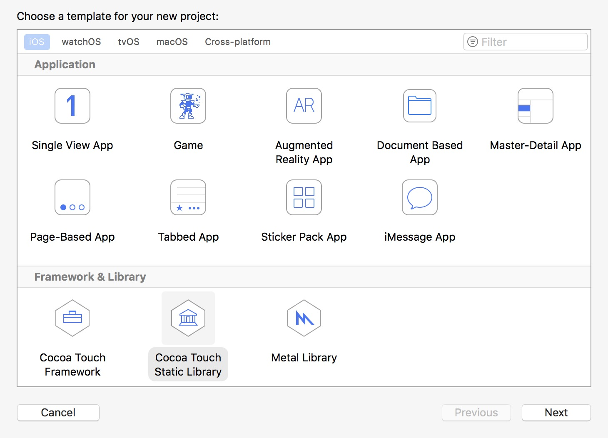  

* step2:  
在“Product Name”中输入产品名称, 并选择一个目录进行保存，然后点击“Create”, 如图: 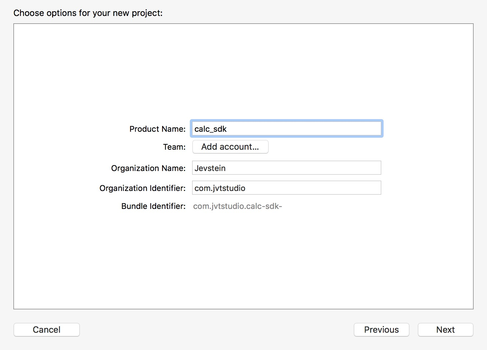     

* step3:  
添加源代码，右键点击项目，在展开的右键菜单中选择“Add Files to...", 选择指定的目录(src/*, 添加过后文件会变灰)，请务必勾选“Create Groups”。注意，默认情况下“Create Groups”被折叠掩藏了，点击options按钮展开， 如图: 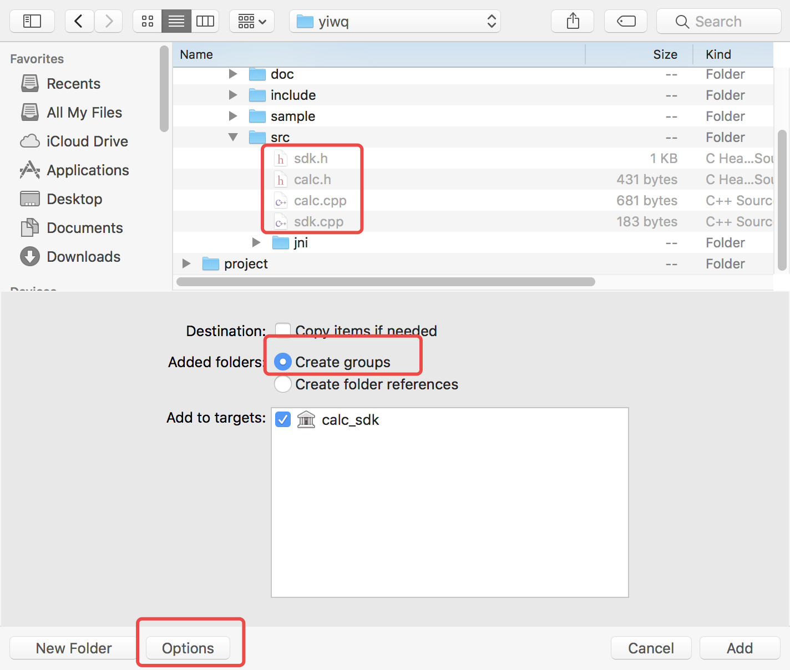  

* step4:  
我们可以选择编译一个真机的静态库，或编译任一模拟器（如“iPhone 8”）的静态库。展开“Products”菜单，点击“Build”进行编译（或按住Comand + B进行编译）。  
【注意】如何编译静态库即可以在真机上运行，又可以在模拟器等多CPU架构下运行呢？  
  首先，将"Build Settings/Build Active Architecture Only"的设置改为NO。其中Debug:Yes表示只编译选中模拟器对应的架构,No则为编译所有模拟器支持的cup架构。如图：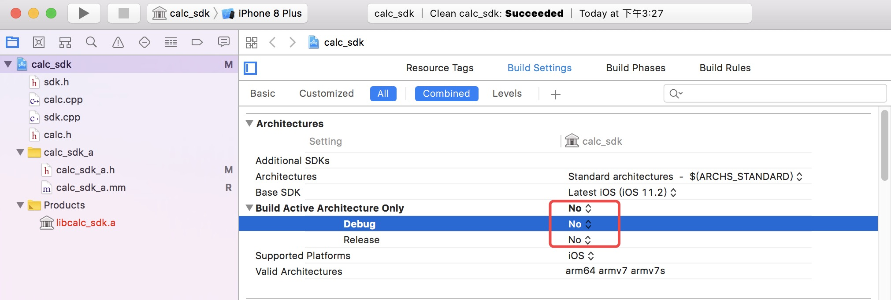  
  然后，通过 lipo 命令将真机和模拟器的静态库进行合并，如打开终端输入：
    ```
    lipo -create iphoneos/libcalc_sdk.a iphonesimulator/libcalc_sdk.a -output libcalc_sdk.a
    ```

* step5:
展开“Project navigator/Products”节点，发现“libcalc_sdk.a”由红色变成了黑色，即编译成功。在刚刚生成的静态库“libcalc_sdk.a”上，右键菜单中选择“Show in Finder”并可以找到该静态库文件。  
【注意】为了保持我们的工程一致，编译前可自定义libcalc_sdk.a生成的路径，如: 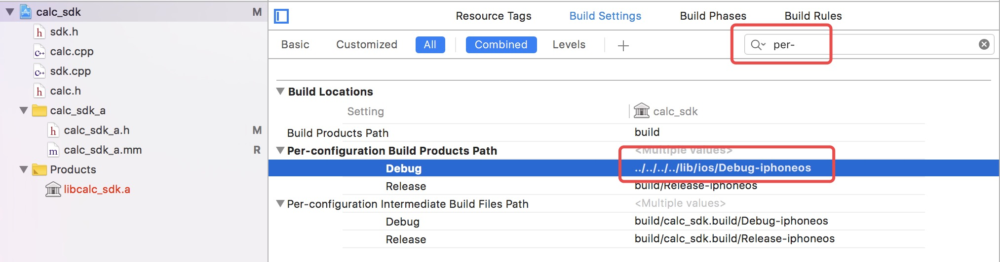   

###  2.2. 在Xcode下通过objective-c加载c++静态库的方法步骤
* step1:  
运行Xcode，选择“Create a new Xcode project", 依次选择“iOS”->“Application”->“Single View App”。如图: 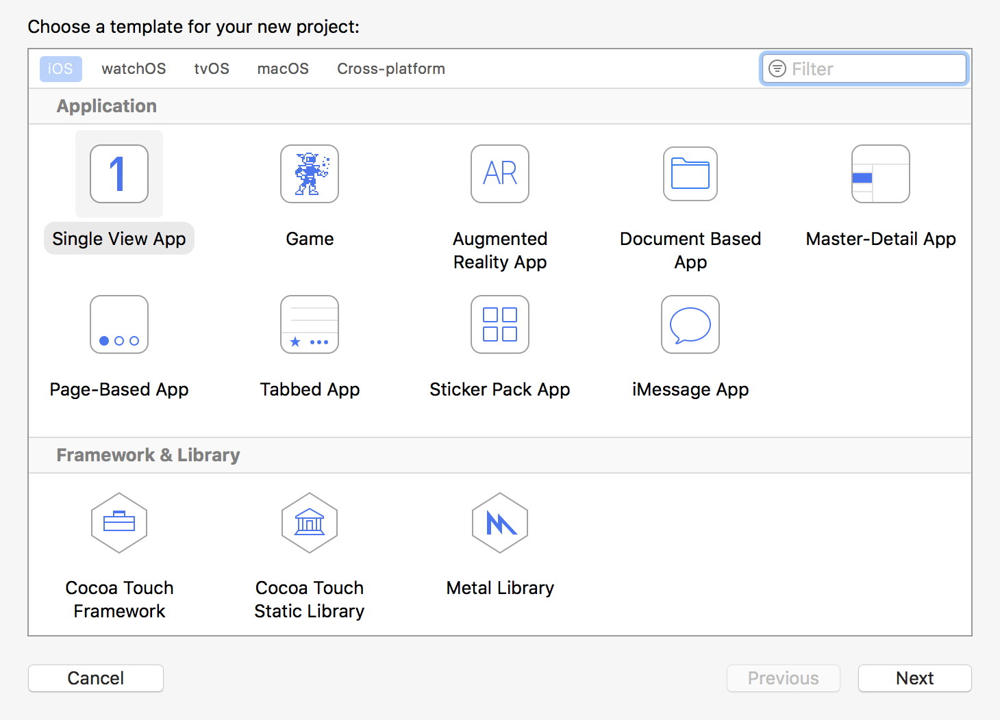    

* step2:  
在“Product Name”中输入产品名称, 并选择一个目录进行保存，然后点击“Create”, 如图: 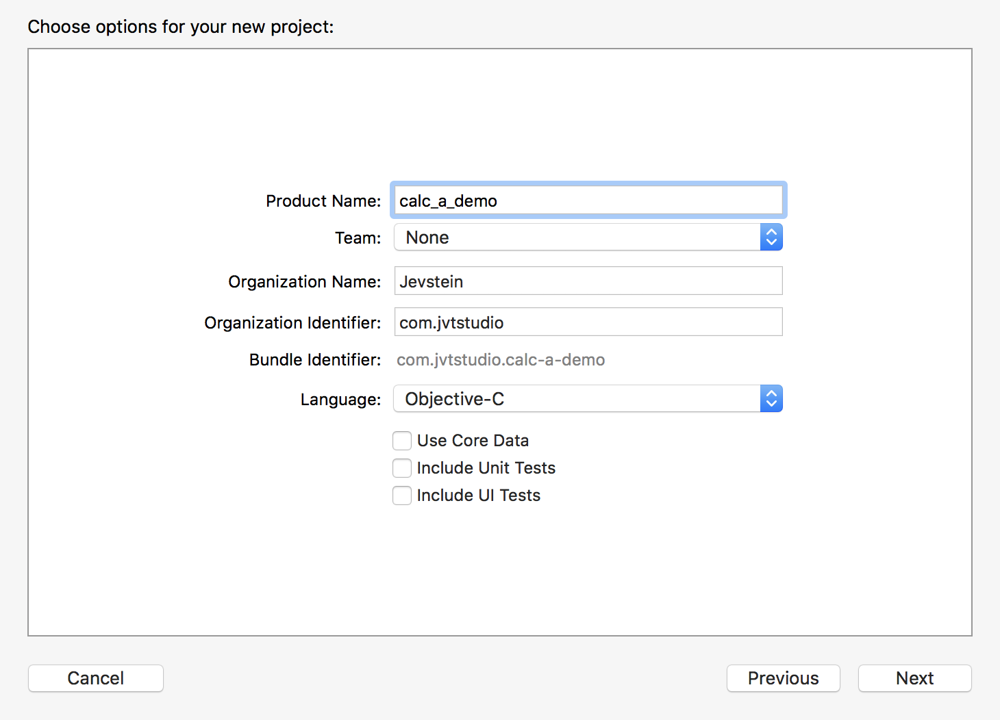  

* step3:  
在"Build Settings/Header Search Paths"下填入包含sdk.h的文件路径, 如图: 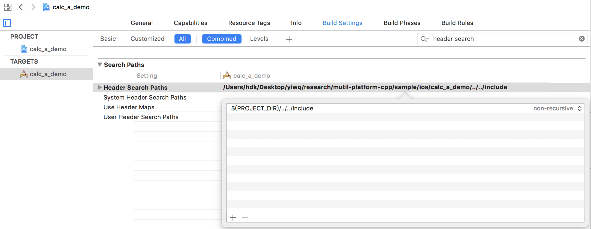  

* step4:  
将libcalc_sdk.a拖拽到项目下，会弹出对话框，在对话框中勾选“Copy items if needed”和“Create Groups”， 如图: 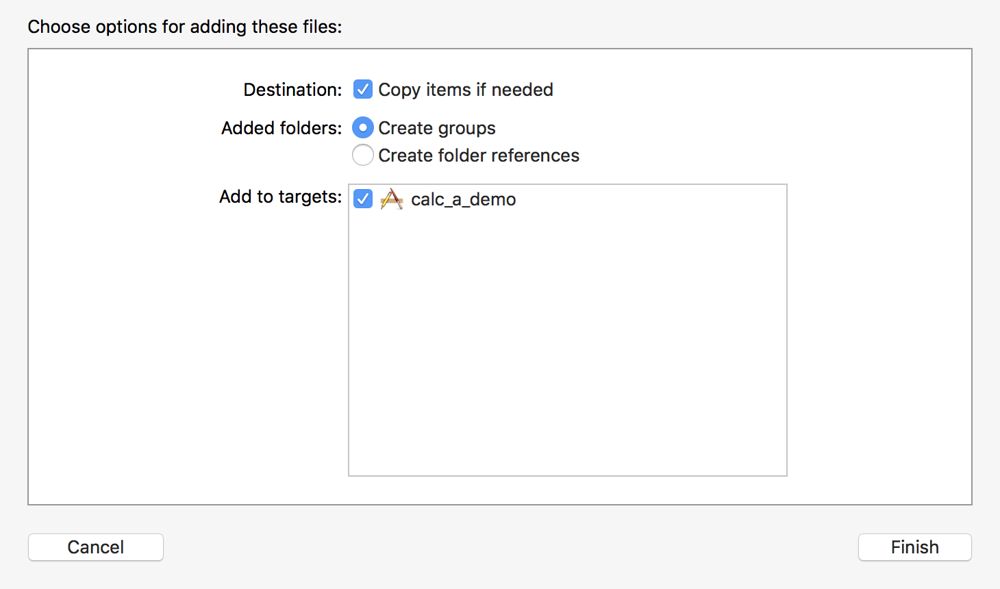  

* step5:  
  为了支持c++程序，需要将.m文件改为.mm文件， 如图: 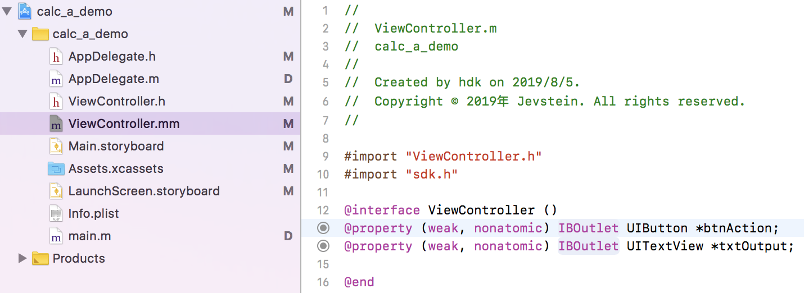 

  

  测试代码如下:  
```objective-c
// 定义c函数指针类型: 因为c++无法直接使用oc对象，需要通过c函数操作oc
typedef void (*ResultHandler)(void *user, const char *msg);

class CalcCbk: public ICalcCbk
{
public:
    CalcCbk() : user_(NULL) {}
    virtual ~CalcCbk() {}
    
    void registerHandle(void *user, ResultHandler func) { 
      this->user_ = user; 
      this->func_ = func; 
    }
    
public:
    virtual int on_result(const char *result) {
        if (user_)  func_(user_, result);//通过c函数回调，与oc交互
        else        printf("'%s'->", result);
        return 0;
    }

private:
    void *user_;
    ResultHandler func_;
};

void onResultHandler(void* userData, const char *msg) {
    ViewController *vc = (__bridge ViewController*)userData;
    NSString *text = [NSString stringWithUTF8String:msg];
    
  	/*回调函数，一般是由库文件单开的工作线程异步返回的。目前例子中未另开线程，故dispatch_async可忽略*/
		//dispatch_async(dispatch_get_global_queue(DISPATCH_QUEUE_PRIORITY_DEFAULT, 0), ^{
		//  dispatch_async(dispatch_get_main_queue(), ^{
          [vc setResultOutput:[NSString stringWithFormat:@"'%@' -> ", text]];
		//  });
		//});
}

- (void)calcTest{
    [self setOutput:@"=== This is an example of using a static library in iOS ==="];
    
    ICalc *calc = jvt_create_calc();
    if (calc){
        [self setOutput: [NSString stringWithFormat:@"note: %s",calc->note()]];
        //[self setOutput: @"bind calc callback"];
        CalcCbk cbk;   calc->bind(&cbk);
        cbk.registerHandle((__bridge void*)self, onResultHandler);
        
        int a = 100;
        int b = 10;
        [self setOutput: [NSString stringWithFormat:@"add(%d, %d) = %d", a, b, calc->add(a, b)]];
        [self setOutput: [NSString stringWithFormat:@"sub(%d, %d) = %d", a, b, calc->sub(a, b)]];
        [self setOutput: [NSString stringWithFormat:@"mul(%d, %d) = %.2f", a, b, calc->mul((double)a, (double)b)]];
        [self setOutput: [NSString stringWithFormat:@"div(%d, %d) = %.2f", a, b, calc->div((double)a, (double)b)]];
        
        jvt_destroy_calc(calc);
    } else {
        [self setOutput: @"error: failed to call jvt_create_calc!"];
    }
    
    [self setOutput: @"========= the end ========="];
}
```


* step6: 运行成功! 如图: 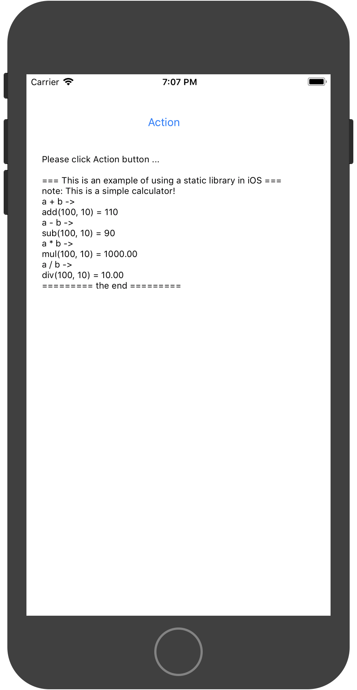   

###  2.3. 遇到的问题及解决方法
* 1.copy items if needs

  生成静态库的step3中，未勾选“Create Groups”。


## 3.动态库: libcalc_sdk.dylib

### 3.1.编译

### 3.2.调用

## 4.打包: libcalc_sdk.framework

### 4.1.编译

### 4.2.调用