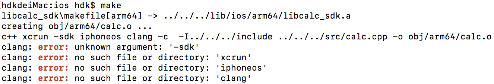
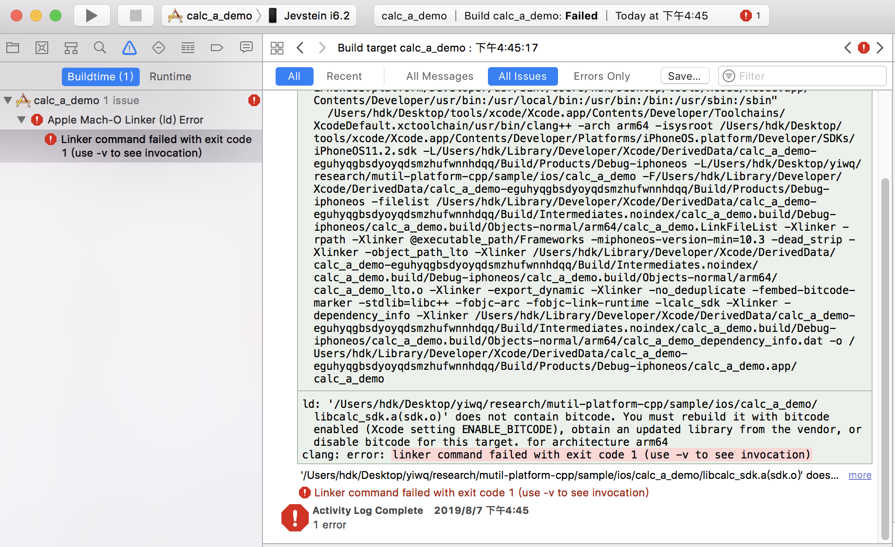

[TOC]

# 跨平台、多语言调用的C++工程化SDK6 - 脚本编译

## 1.背景

​	

​	详见首篇: [跨平台、多语言调用的C++工程化SDK1 - 背景篇](file:///1.背景.md)

​	详见源码: [源码示例](sss)

工程目录结构如下：

```shell
.
├── bin
├── build
│   ├── project
│   │   ├── ios
│   │   │   ├── calc_sdk_a
│   │   │   └── calc_sdk_f
│   │   └── win32
│   │       └── calc_sdk_dll
│   └── script
│       ├── linux
│       │   ├── a
│       │   │   ├── demo.mk
│       │   │   ├── makefile
│       │   │   └── sdk.mk
│       │   ├── so
│       │   │   ├── demo.mk
│       │   │   ├── makefile
│       │   │   └── sdk.mk
│       │   └── makefile
│       ├── mac
│       │   ├── a
│       │   │   ├── makefile
│       │   │   ├── platform.mk
│       │   │   └── sdk.mk
│       │   ├── f
│       │   │   └── makefile
│       │   └── makefile
│       └── windows
│           ├── dll
│           ├── lib
│           └── makefile
├── doc
├── include
│   └── sdk.h
├── lib
├── sample
│   ├── ios
│   │   ├── calc_a_demo
│   │   └── calc_f_demo
│   ├── linux
│   │   ├── calc_a_demo
│   │   └── calc_so_demo
│   └── win32
│       └── calc_dll_demo
└── src
    ├── calc.cpp
    ├── calc.h
    ├── sdk.cpp
    └── sdk.h
```

本篇描述如何不用IDE（如: Xcode、virtual studio等），仅通过脚本，一键自动化完成对应操作系统的sdk编译。


## 2.自动化脚本编译

​	当sdk的功能越来越多，越来越复杂，相应的代码文件也变得越来越庞大，这时如果还采用IDE则操作繁琐、效率低下，且极易出错。比如，当用virtual studio将sdk编译成.dll文件后，demo测试符合预期结果；但还得用Xcode将sdk编译成.a文件供iOS App调用，这时如果Xcode漏加了一个cpp文件，编译能通过，但链接时会报错。若两个IDE编译sdk的间隔时间太长，一旦报错，往往不容易排查。这时来一句“我擦”，然后上趟厕所，或者抽根烟压压惊，再回来接着折腾，一个小时就过去了。。。后面还有工作量呢，晚上接着加班吧。。。

​	可能“懒惰”的老程序员早就遇见了这种情况，那有没有一种办法能够一键执行，顺利完成适应各种平台和App所需的sdk的编译呢？当然有，那就是写脚本，一劳永逸地解决这件伤心事。

​	这里我们采用makefile来编译sdk，具体makefile的语法这里不细讲，本文主要讲解如何组织众多不同的makefile，完成复杂的实际项目工程在不同操作系统平台下的一键编译。抓挠的是，若对makefile语法不熟的读者，对本文的理解会有些吃力，不妨先看看[由浅入深一文精通makefile](ss)这篇文章，恶补一下相关知识。顺便提醒一下，精通makefile是很有必要的，尤其是从事linux后台开发的c/c++程序员，是否能写makefile（或cmake等），一定程度上反应了他是否具备驾驭大型复杂项目的开发能力。

​	以下内容请结合项目[源码示例](sss)进行阅读，具体细节直接看脚本！

### 2.1.在Windows下编译sdk脚本

#### 2.1.1.编译windows下的sdk


#### 2.1.2.编译Android下的sdk


### 2.2.在Linux下编译sdk脚本

#### 2.2.1. 编译linux下的sdk（该sdk同样适用于mac系统）

```shell
└── build
    └── script
        └── linux
            ├── a
            │   ├── demo.mk
            │   ├── makefile
            │   └── sdk.mk
            ├── so
            │   ├── demo.mk
            │   ├── makefile
            │   └── sdk.mk
            └── makefile
```

​	在linux系统下，执行build/script/linux/makefile，即可同时生成静态库(libcalc_sdk.a)和动态库(libcalc_sdk.so)，且生成对应的应用程序calc_a_demo和calc_so_demo。也可根据需要单独生成静态库或动态库。

​	同样，该脚本在mac系统下也可编译，且运行。

### 2.3.在mac下编译sdk脚本

​	目前只演示了静态库(libcalc_sdk.a)的脚本编译，framework有待进一步研究。如下：

```shell
└── build
    └── script
        └── mac
            ├── a
            │   ├── makefile
            │   ├── platform.mk
            │   └── sdk.mk
            └── makefile
```

#### 2.3.1.编译mac下的sdk

​	请看build/script/mac/makefile，make mac即生成mac下的sdk。

#### 2.3.2.编译iOS下的sdk

​	请看build/script/mac/makefile，make iOS即生成iOS下的sdk。其中，make lipo将真机和模拟器的静态库进行合并。也就make iOS lipo即可完成同时运行于真机和模拟器的静态库。


## 3.脚本编译遇到的问题

### 3.1.iOS编译的问题

#### 3.1.1.SDK "iphoneos" cannot be located

如图：  


  * 1).问题：  
```shell
  mac$ xcrun --sdk iphoneos --show-sdk-path
  xcrun: error: SDK "iphoneos" cannot be located
```

  * 2).原因:  
```shell
  mac$ xcode-select --print-path
  /Library/Developer/CommandLineTools

  mac$ xcodebuild -showsdks
  xcode-select: error: tool 'xcodebuild' requires Xcode, but active developer directory '/Library/Developer/CommandLineTools' is a command line tools instance
```

  * 3).解决方法：给Xcode命令行工具指定路径  
```shell
  mac$ sudo xcode-select --switch /Applications/Xcode.app/Contents/Developer/
```

  * 4).验证：  
```shell
  mac$ xcrun --sdk iphoneos --show-sdk-path
```

  参考：[SDK "iphoneos" cannot be located](https://www.cnblogs.com/zzugyl/p/5438869.html)  

#### 3.1.2.does not contain bitcode

如图：  
   

  * 1).原因：  
    真机调试时，出现图上错误。是因为某些二进制库不支持bitcode.而Xcode默认是要支持bitcode的,而且如果支持的话,其中所有的二进制库和framework都必须包含bitcode.  
    参考:[“does not contain bitcode.”的错误解决办法](https://www.jianshu.com/p/c5b38d1b6dfa)  

  * 2).解决：  
    将bitcode直接关掉就可以了。target ---> Built Seeting --->搜索 bitcode  --->将Yes置为No


> 参考：  
>     [多平台编译脚本以及makefile自动化编译总结](https://blog.csdn.net/SoaringLee_fighting/article/details/82903592)  
>     [mac和ios通用编译环境](https://blog.csdn.net/SoaringLee_fighting/article/details/82856442)  