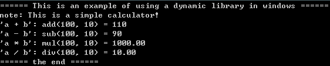

<!-- vscode-markdown-toc -->
* 1. [前言](#)
* 2. [windows下的c++组件调用](#windowsc)
* 3. [linux下的c++组件调用](#linuxc)
* 4. [mac下的c++组件调用](#macc)
* 5. [android下的c++组件调用](#androidc)
* 6. [iOS下的c++组件调用](#iOSc)
	* 6.1. [编译链接c++静态库(.a)](#c.a)
		* 6.1.1. [利用Xcode生成c++静态库的方法步骤](#Xcodec)
		* 6.1.2. [objective-c加载c++静态库的方法步骤](#objective-cc)
		* 6.1.3. [遇到的问题及解决方法](#-1)
	* 6.2. [打包c++静态或动态库(.framework)](#c.framework)

<!-- vscode-markdown-toc-config
	numbering=true
	autoSave=true
	/vscode-markdown-toc-config -->
<!-- /vscode-markdown-toc -->

# 跨平台、多语言调用c++组件
##  1. <a name=''></a>前言  
  常言道：“千年的语言万年的c”。虽然近些年各类计算机语言层出不穷，但c语言作为最接近底层硬件的计算机高级语言，到目前为止，从来没有跌出过排行榜的前十名。同时作为超类的c++语言，虽然因为其自身的特性带来诸多争议，但它的火热几十年来也从未曾未退过，况且C++新标准的出炉，更是为它带来无限的活力。不可置否，在音视频开发、游戏引擎等追求高性能的领域，往往就采用c或c++作为sdk组件，来支撑上层以java、c#等语言开发的应用程序。  
  本系列文章及工程范例，就以一个支持“四则运算”的计算器作为c++ sdk组件实现的简单功能，讲述如何在linux、windows、mac、android、iOS等不同的主流系统平台下，且使用c++、java、objective-c等各种不同的上层语言来对C++组件进行调用。简单来说，就是演示如何实现一个支持跨平台、多语言调用的c++组件。[下载源码示例](sss)  
  先来看看利用c++实现一个“四则运算”的计算器代码，功能相当简单：  
```
class Calc : public ICalc
{
public:
    Calc(): cbk_(NULL) {}
    virtual ~Calc() {}

public:
    virtual const char* note() {
        return "This is a simple calculator!";
    }
    virtual void bind_cbk(ICalcCbk* cbk) {
        cbk_ = cbk;
    }
    virtual int add(int a, int b) {
        if (cbk_) cbk_->on_result("a + b");
        return a + b;
    }
    virtual int sub(int a, int b) {
        if (cbk_) cbk_->on_result("a + b");
        return a - b;
    }
    virtual double mul(double a, double b) {
        if (cbk_) cbk_->on_result("a + b");
        return a * b;
    }
    virtual double div(double a, double b) {
        if (cbk_) cbk_->on_result("a + b");
        return IS_DOUBLE_ZERO(b) ? 0 : (a / b);
    }
	
private:
    ICalcCbk* cbk_;
};
```  
  Calc类实现了加减乘除，其中ICalcCbk是一个抽象类，提供了一个接口on_result()由上层实现。示例中每当操作四则运算时都会将sdk的信息通过on_result()回调到上层。正常实现的效果图如下：  
  在软件工程化管理过程中，我们一般不会将源码直接给到第三方使用，而是提供一个库(library)文件。所谓的库文件，说白了就是一段编译好的二进制代码（相当于一个黑盒子），加上头文件（暴露出操作黑盒子的方法）就可以供别人使用。库的好处还可以减少编译的时间，对于某些不会进行大的改动的代码，我们把它打包成库，而库已经是编译好了的二进制文件，所以编译时只需要链接（link）一下即可，不再浪费编译的时间。  
  说到链接（Link），则有两种方式：静态链接和动态链接。于是便产生了静态库和动态库。
* 静态库  
  静态库即静态链接库。 静态库在编译的时候会被直接拷贝一份，复制到目标程序里，这段代码在目标程序里就不会再改变了。  
  静态库的好处: 编译完成之后，库文件实际上就没有作用了。目标程序没有外部依赖，直接就可以运行。  
  静态库的缺点：会使目标程序的体积增大。  
  静态库文件在不同操作系统平台下的表现形式如下：  
    ```
    Windows：.lib  
    linux/mac/android/ios: .a  
    ```
* 动态库  
  动态库即动态链接库。与静态库相反，动态库在编译时并不会被拷贝到目标程序中，目标程序中只会存储指向动态库的引用。等到程序运行时，动态库才会被真正加载进来。  
  动态库的优点: 不需要拷贝到目标程序中，不会影响目标程序的体积，而且同一份库可以被多个程序使用（因为这个原因，动态库也被称作共享库）。同时，编译时才载入的特性，也可以让我们随时对库进行替换，而不需要重新编译代码。  
  动态库带来的问题: 动态载入会带来一部分性能损失，使用动态库也会使得程序依赖于外部环境。如果环境缺少动态库或者库的版本不正确，就会导致程序无法运行（Linux下喜闻乐见的 lib not found 错误）。  
  动态库文件在不同操作系统平台下的表现形式如下：  
    ```
    Windows：.dll  
    linux/android: .so  
    mac: .so, .dylib  
    ios: .dylib  
    ```  
* framework  
  除了上面提到的.a 和.dylib 之外，Mac OS/iOS 平台还可以使用Framework。Framework实际上是一种打包方式，将库的二进制文件，头文件和有关的资源文件打包到一起，方便管理和分发。具体将在iOS章节会详细讲述。  

  再看看例子中的导出接口：  
```
// sdk.h
#ifndef _JVT_SDK_H_
#define _JVT_SDK_H_

#if defined(__cplusplus)
#	define EXT_C extern "C"
#else
#	define EXT_C
#endif

#ifdef WIN32
#	ifdef CALC_SDK_DLL_EXPORTS
#		define SDK_API EXT_C __declspec(dllexport)
#	else
#		define SDK_API EXT_C __declspec(dllimport)
#	endif//CALC_SDK_DLL_EXPORTS
#	define CALLCON /*__stdcall*/
#else
#	define SDK_API extern
#	define CALLCON
#endif//WIN32

//#if defined(__cplusplus)
class ICalcCbk
{
public:
    virtual ~ICalcCbk(){}
    virtual int on_result(const char *result) = 0;
};

class ICalc
{
public:
    virtual ~ICalc(){}
    virtual const char* note() = 0;
    virtual void bind_cbk(ICalcCbk* cbk) = 0;
	
    virtual int add(int a, int b) = 0;         
    virtual int sub(int a, int b) = 0;         
    virtual double mul(double a, double b) = 0;
    virtual double div(double a, double b) = 0;
};
//#endif//__cplusplus

SDK_API ICalc* CALLCON jvt_create_calc();
SDK_API	void CALLCON jvt_destroy_calc(ICalc* calc);

#endif//_JVT_SDK_H_
```
  有了“黑盒子”库文件(如: 静态库calc_sdk.a或动态库calc_sdk.so)，再加上“操作黑盒子”的头文件sdk.h，即可被其它应用程序所集成了。接下来，便一一讲述在不同的主流操作系统平台下，如何将上面实现了计算器功能的c++代码，生成对应的静态库或动态库，并供上层语言调用。     
##  2. <a name='windowsc'></a>windows下的c++组件调用  

##  3. <a name='linuxc'></a>linux下的c++组件调用  
##  4. <a name='macc'></a>mac下的c++组件调用  

##  5. <a name='androidc'></a>android下的c++组件调用  

##  6. <a name='iOSc'></a>iOS下的c++组件调用   
  为提供给iOS调用，通常会将c++编译成以下几种方式:  
* 静态库: .a
* 动态库: .dylib
* 打包方式: .framework  

  .a与其他系统提到的静态库原理雷同，不再赘述。其中, 动态库.dylib只有iOS系统提供的方可使用。众所周知，iOS处于安全考虑，将APP应用程序运行在沙盒中，不同的程序之间不能共享代码。在iOS开发过程中，你可以自己编译成.dylib，且被iOS的APP应用程序调用成功，但是含有.dylib的APP应用程序不能上架App Store。况且动态下载代码也被苹果明令禁止，因此，实际上动态库.dylib在iOS应用开发中是没有必要存在的。  
  然而，.framework有所不同，它实际上是一种打包方式，将库的二进制文件，头文件和有关的资源文件打包到一起，方便管理和分发。在 iOS 8 之前，iOS 平台不支持使用动态 .framework，开发者可以使用的.framework 只有苹果自家的 UIKit.framework，Foundation.framework 等。此时，开发者想要在 iOS 平台共享代码，唯一的选择就是打包成静态库 .a 文件，同时附上头文件（例如微信的SDK）。但是这样的打包方式不够方便，使用时也比较麻烦，大家还是希望共享代码都能能像 Framework 一样，直接扔到工程里就可以用。于是人们想出了各种奇技淫巧去让 Xcode Build 出 iOS 可以使用的 Framework，但这种方法产生的 Framework 还有 “伪”(Fake) Framework 和 “真“(Real) Framework 的区别。  
  当iOS 8/Xcode 6 推出之后，iOS 平台添加了动态库的支持，同时 Xcode 6 也原生自带了 Framework 支持（动态和静态都可以），上面提到的的奇技淫巧也就没有必要了。为什么 iOS 8 要添加动态库的支持？唯一的理由大概就是 Extension 的出现。Extension 和 App 是两个分开的可执行文件，同时需要共享代码，这种情况下动态库的支持就是必不可少的了。但是这种动态 Framework 和系统的 UIKit.Framework 还是有很大区别。系统的 Framework 不需要拷贝到目标程序中，我们自己做出来的 Framework 哪怕是动态的，最后也还是要拷贝到 App 中（App 和 Extension 的 Bundle 是共享的），因此苹果又把这种 Framework 称为 Embedded Framework。

###  6.1. <a name='c.a'></a>编译链接c++静态库(.a)
* step1:  
运行Xcode，选择“Create a new Xcode project", 依次选择“iOS”->“Framework & Library”->“Cocoa Touch Static Library”。如图:   

* step2:  
在“Product Name”中输入产品名称, 并选择一个目录进行保存，然后点击“Create”, 如图:      

* step3:  
添加源代码，右键点击项目，在展开的右键菜单中选择“Add Files to...", 选择指定的目录(src/*, 添加过后文件会变灰)，请务必勾选“Create Groups”。注意，默认情况下“Create Groups”被折叠掩藏了，点击options按钮展开， 如图:   

* step4:  
我们可以选择编译一个真机的静态库，或编译任一模拟器（如“iPhone 6”）的静态库。展开“Products”菜单，点击“Build”进行编译（或按住Comand + B进行编译）。  
注意, 可以通过命令将真机和模拟器合并，如：
```
```  

* step5:
展开“Products”节点，发现“libcalc_sdk.a”由红色变成了黑色，即编译成功后。通过右键选择刚刚生成的静态库“libcalc_sdk.a”，在右键菜单中选择“Show in Finder”可以找到该静态库文件 

注意：为了保持工程一致，编译前自定义.a的生成路径，如:   

####  6.1.1. <a name='Xcodec'></a>利用Xcode生成c++静态库的方法步骤
* 操作步骤：  

####  6.1.2. <a name='objective-cc'></a>objective-c加载c++静态库的方法步骤
* 操作步骤：  

####  6.1.3. <a name='-1'></a>遇到的问题及解决方法
* 1.copy items if needs
* 

###  6.2. <a name='c.framework'></a>打包c++静态或动态库(.framework)