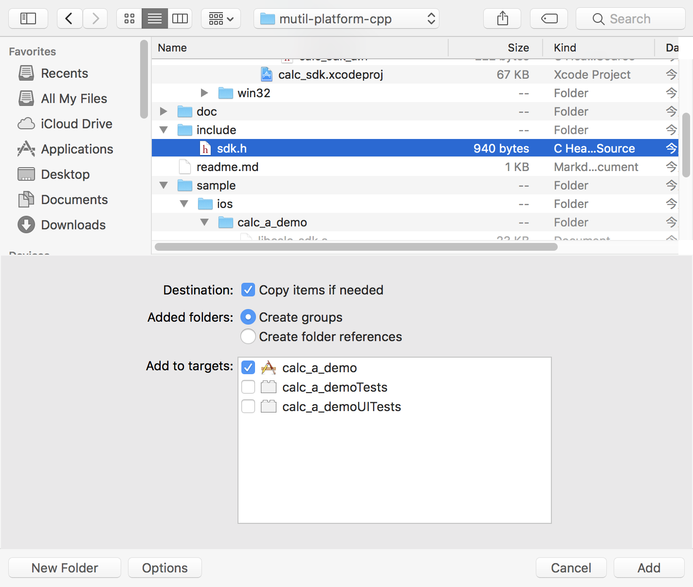

<!-- vscode-markdown-toc -->
* 1. [前言](#)
* 2. [windows下的c++组件调用](#windowsc)
* 3. [linux下的c++组件调用](#linuxc)
* 4. [mac下的c++组件调用](#macc)
* 5. [android下的c++组件调用](#androidc)
* 6. [ios下的c++组件调用](#iosc)
	* 6.1. [调用c++的.a文件](#c.a)
		* 6.1.1. [xcode生成.a文件](#xcode.a)
		* 6.1.2. [加载c++ .a文件](#c.a-1)

<!-- vscode-markdown-toc-config
	numbering=true
	autoSave=true
	/vscode-markdown-toc-config -->
<!-- /vscode-markdown-toc -->

# 跨平台、多语言调用c++组件
##  1. <a name=''></a>前言  
  常言道：“千年的语言万年的c”。虽然近些年各类计算机语言层出不穷，但c语言作为最接近底层硬件的计算机高级语言，到目前为止，从来没有跌出过排行榜的前十名。同时作为超类的c++语言，虽然因为其自身的特性带来诸多争议，但它的火热几十年来也从未曾未退过，况且C++新标准的出炉，更是为它带来无限的活力。不可置否，在音视频开发、游戏引擎等追求高性能的领域，往往就采用c或c++作为sdk组件，来支撑上层以java、c#等语言开发的应用程序。  
  本系列文章及工程范例，就以一个支持“四则运算”的计算器作为c++ sdk组件实现的简单功能，讲述如何在linux、windows、mac、android、iOS等不同的主流系统平台下，且使用c++、java、objective-c等各种不同的上层语言来对C++组件进行调用。简单来说，就是演示如何实现一个支持跨平台、多语言调用的c++组件。[下载源码示例](sss)  
  先来看看利用c++实现一个“四则运算”的计算器代码，功能相当简单：  
```
class Calc : public ICalc
{
public:
    Calc(): cbk_(NULL) {}
    virtual ~Calc() {}

public:
    virtual const char* note() {
        return "This is a simple calculator!";
    }
    virtual void bind_cbk(ICalcCbk* cbk) {
        cbk_ = cbk;
    }
    virtual int add(int a, int b) {
        if (cbk_) cbk_->on_result("a + b");
        return a + b;
    }
    virtual int sub(int a, int b) {
        if (cbk_) cbk_->on_result("a + b");
        return a - b;
    }
    virtual double mul(double a, double b) {
        if (cbk_) cbk_->on_result("a + b");
        return a * b;
    }
    virtual double div(double a, double b) {
        if (cbk_) cbk_->on_result("a + b");
        return IS_DOUBLE_ZERO(b) ? 0 : (a / b);
    }
	
private:
	ICalcCbk* cbk_;
};
```  
  Calc类实现了加减乘除，其中ICalcCbk是一个抽象类，提供了一个接口on_result()由上层实现。示例中每当操作四则运算时都会将sdk的信息通过on_result()回调到上层。正常实现的效果图如下：
  在软件工程化管理过程中，我们一般不会将源码直接给到第三方使用，而是提供一个库(library)文件。所谓的库文件，说白了就是一段编译好的二进制代码（相当于一个黑盒子），加上头文件（暴露出操作黑盒子的方法）就可以供别人使用。库的好处还可以减少编译的时间，对于某些不会进行大的改动的代码，我们把它打包成库，而库已经是编译好了的二进制文件，所以编译时只需要链接（link）一下即可，不再浪费编译的时间。  
  说到链接（Link），则有两种方式：静态链接和动态链接。于是便产生了静态库和动态库。
* 静态库  
  静态库即静态链接库。 静态库在编译的时候会被直接拷贝一份，复制到目标程序里，这段代码在目标程序里就不会再改变了。  
  静态库的好处: 编译完成之后，库文件实际上就没有作用了。目标程序没有外部依赖，直接就可以运行。其缺点也很明显，就是会使用目标程序的体积增大。  
  静态库文件在不同操作系统平台下的表现如下：  
    ```
    Windows：.lib  
    linux/mac/android/ios: .a  
    ```
* 动态库  
  动态库即动态链接库。与静态库相反，动态库在编译时并不会被拷贝到目标程序中，目标程序中只会存储指向动态库的引用。等到程序运行时，动态库才会被真正加载进来。  
  动态库的优点: 不需要拷贝到目标程序中，不会影响目标程序的体积，而且同一份库可以被多个程序使用（因为这个原因，动态库也被称作共享库）。同时，编译时才载入的特性，也可以让我们随时对库进行替换，而不需要重新编译代码。动态库带来的问题: 动态载入会带来一部分性能损失，使用动态库也会使得程序依赖于外部环境。如果环境缺少动态库或者库的版本不正确，就会导致程序无法运行（Linux下喜闻乐见的 lib not found 错误）。  
  动态库文件在不同操作系统平台下的表现如下：  
    ```
    Windows：.dll  
    linux/android: .so  
    mac: .so, .dylib  
    ios: .dylib  
    ```  
* framework  
  除了上面提到的.a 和.dylib 之外，Mac OS/iOS 平台还可以使用Framework。Framework实际上是一种打包方式，将库的二进制文件，头文件和有关的资源文件打包到一起，方便管理和分发。具体将在iOS章节会详细讲述。  

  接下来，便一一讲述在不同的主流操作系统平台下，如何将上面实现了计算器功能的c++代码，再生成对应的静态库或动态库，供上层语言调用。
##  2. <a name='windowsc'></a>windows下的c++组件调用  

##  3. <a name='linuxc'></a>linux下的c++组件调用  
##  4. <a name='macc'></a>mac下的c++组件调用  

##  5. <a name='androidc'></a>android下的c++组件调用  

##  6. <a name='iosc'></a>ios下的c++组件调用   
   谈谈.a与framework区别
###  6.1. <a name='c.a'></a>调用c++的.a文件
####  6.1.1. <a name='xcode.a'></a>xcode生成.a文件

####  6.1.2. <a name='c.a-1'></a>加载c++ .a文件
* 操作步骤：
* 所遇问题：  
  1.copy items if needs